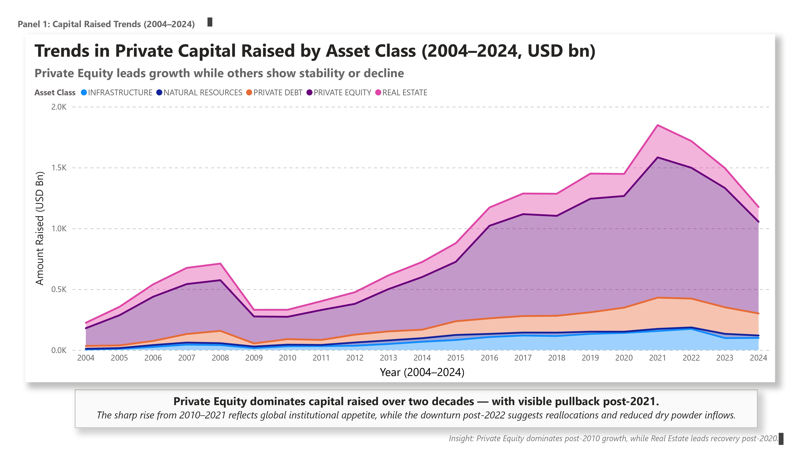
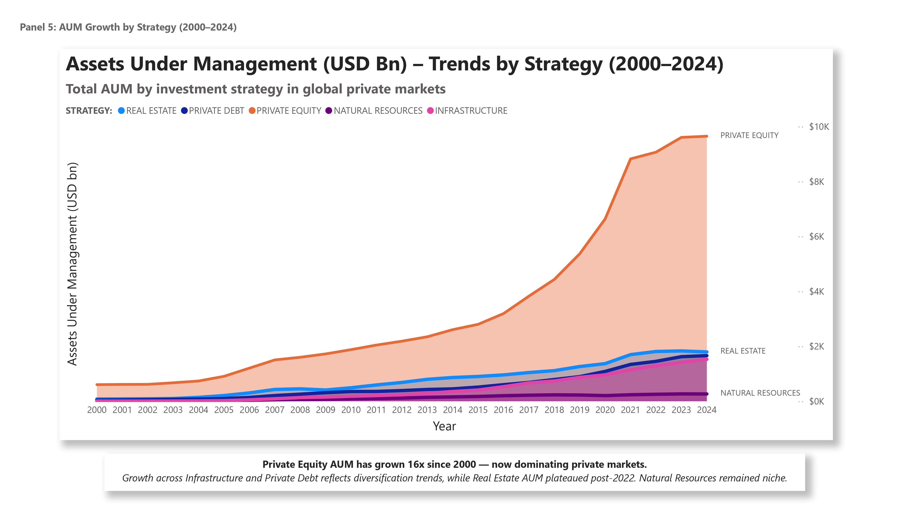

# Investment Fund Analytics Dashboard (Power BI)

## Summary

This project analyzes $24.2 trillion in private capital across six asset classes from 2000 to 2025—identifying peak investment years, volatility patterns, and post-2022 shifts. Built in Power BI, it's structured as an institutional-grade reporting suite designed to help hiring managers evaluate business acumen, storytelling, and analytical execution.

---

## Key Insights

- Private Equity surged post-2010 but slowed sharply after 2022
- 2021 marked peak capital deployment and deal activity
- Venture Capital was the most volatile; Infra and Private Debt offered consistent returns
- Hedge Funds led in fund launches, but VC dominated deal activity until 2022
- AUM trends shifted from Real Estate toward Infra and Private Debt

---

## Tools & Techniques Used

- **Power BI** – dashboards, tooltips, data modeling, DAX
- **Excel** – data cleanup, formatting, preprocessing
- **Design & Storytelling** – insight captions, visual hierarchy, layout polish

---

## Dashboard Preview (Selected Panels)

### Capital Raised Over Time

### IRR Trends by Strategy

### AUM Growth Across Strategies

---

## Dataset Summary

- **Source**: Curated from Preqin (BlackRock) strategy-level datasets
- **Scope**: ~5 structured tables | Time period: 2000–2025
- **Fields**: IRR, Capital Raised, Deal Volume, AUM
- **Asset Classes**: PE, VC, Real Estate, Infra, Private Debt, Hedge Funds
- **Process**: Cleaned in Excel, modeled in Power BI using fact-dimension schema

---

## Techniques Demonstrated

- Interactive visuals: line, stacked area, bar, and combo charts
- DAX: measures for CAGR, IRR calculations, and dynamic tooltips
- Layout design: titles, spacing, shape overlays, responsive insights

---

## Future Enhancements

- PME Benchmarking vs Public Markets
- Region-based strategy filters
- GP/LP segmentation panels
- Predictive modeling for strategy-level forecasts

---

## Contact

- GitHub: [dibyajyotisamal](https://github.com/dibyajyotisamal)
- LinkedIn: [dibyajyoti-samal](https://www.linkedin.com/in/dibyajyoti-samal/)

---

> "Built for clarity. Backed by analysis. Designed to impress."

