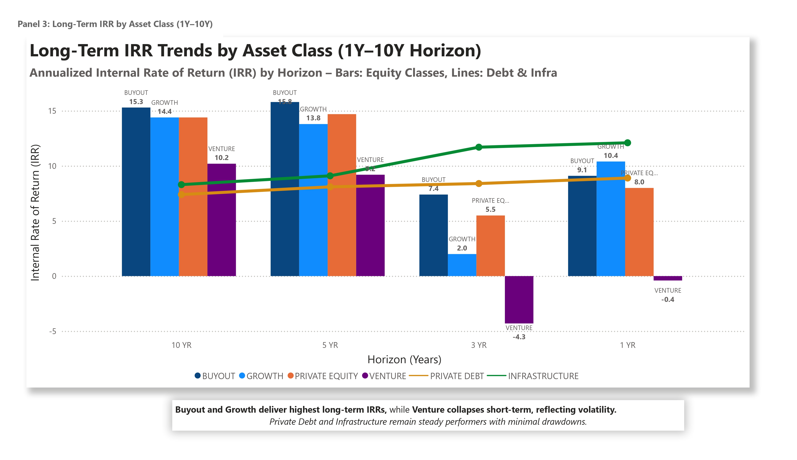

# Investment Fund Analytics Dashboard (Power BI)

## Summary

This dashboard analyzes **$24.2 trillion in global private capital** across six asset classes from 2000 to 2025. Built for **asset managers, institutional analysts, and strategic decision-makers**, it uncovers critical shifts in **capital flow**, **AUM growth**, and **IRR trends**, offering actionable insight into **market timing**, **strategy resilience**, and **allocation efficiency**.

---

## Business Insights & Recommendations

- **VC and PE IRR** dropped significantly post-2022 → suggests caution in allocating capital to these high-risk strategies in 2025.
- **Infrastructure and Private Debt** show stable IRR and consistent growth → more resilient to macroeconomic shocks.
- **2021** marked the peak of capital deployment and deal volume → aligns with global liquidity trends.
- **Real Estate AUM** growth stagnated → investors may be rotating capital into debt or infrastructure.
- **Fund launches** rose sharply in Hedge Funds post-2020 → potentially indicating lower barriers to entry or speculative growth.
- **Deal volume decline post-2022** indicates reduced investor appetite or tightening conditions.

---

## Tools & Techniques Used

- **Power BI** – dashboards, dynamic tooltips, data modeling, DAX (see below)
- **Excel** – raw data cleanup, preprocessing, formatting
- **Design & Storytelling** – visual hierarchy, panel layout, annotation captions

---

## Technical Highlights (DAX)

- **YoY Change (%):**

  ```DAX
  YoY % Change = 
   ([ThisYear] - [LastYear]) / [LastYear] * 100
  ```

  _Tracks yearly fluctuations in capital raised and fund launches—used to highlight yearly momentum or slowdowns in fundraising and fund launches._

- **Average IRR by Strategy:**

  ```DAX
  Avg IRR = AVERAGE(StrategyTable[IRR])
  ```

  _Computes the average internal rate of return for each asset class—used to compare profitability across fund strategies._

---

## Dashboard Preview (Selected Panels)

### Capital Raised Over Time


### IRR Trends by Strategy


### AUM Growth Across Strategies


---

## Dataset Summary

- **Source**: [Preqin via BlackRock insights](https://pro.preqin.com)
- **Time Range**: 2000–2025
- **Data Format**: 5 structured tables (fact + dimension model)
- **Metrics**: Capital Raised, AUM, Deal Volume, IRR
- **Asset Classes**: PE, VC, Real Estate, Infra, Private Debt, Hedge Funds
- **Preprocessing**: Excel cleanup → Power BI modeling

---

## Future Enhancements

- Regional segmentation & filters
- Forecasting metrics using time series analysis

---

## Contact

- GitHub: [dibyajyotisamal](https://github.com/dibyajyotisamal)
- LinkedIn: [dibyajyoti-samal](https://www.linkedin.com/in/dibyajyoti-samal/)

---
